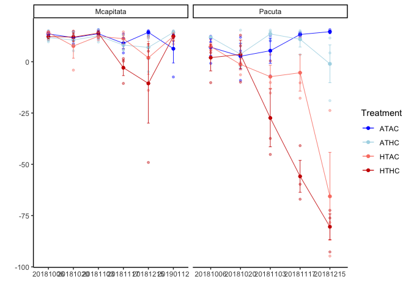
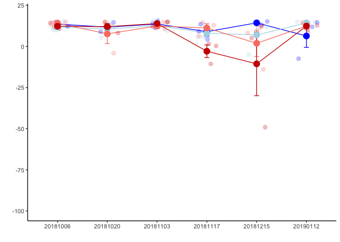
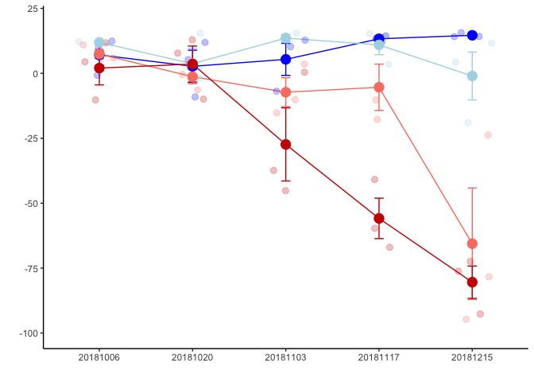

Color Score
================
Author: Emma Strand; <emma_strand@uri.edu>

## Load libraries

``` r
library(plyr)
library(dplyr)
```

    ## 
    ## Attaching package: 'dplyr'

    ## The following objects are masked from 'package:plyr':
    ## 
    ##     arrange, count, desc, failwith, id, mutate, rename, summarise,
    ##     summarize

    ## The following objects are masked from 'package:stats':
    ## 
    ##     filter, lag

    ## The following objects are masked from 'package:base':
    ## 
    ##     intersect, setdiff, setequal, union

``` r
library(tidyverse)
```

    ## ── Attaching packages ─────────────────────────────────────── tidyverse 1.3.1 ──

    ## ✔ ggplot2 3.3.6     ✔ purrr   0.3.4
    ## ✔ tibble  3.1.8     ✔ stringr 1.4.0
    ## ✔ tidyr   1.2.0     ✔ forcats 0.5.1
    ## ✔ readr   2.1.2

    ## ── Conflicts ────────────────────────────────────────── tidyverse_conflicts() ──
    ## ✖ dplyr::arrange()   masks plyr::arrange()
    ## ✖ purrr::compact()   masks plyr::compact()
    ## ✖ dplyr::count()     masks plyr::count()
    ## ✖ dplyr::failwith()  masks plyr::failwith()
    ## ✖ dplyr::filter()    masks stats::filter()
    ## ✖ dplyr::id()        masks plyr::id()
    ## ✖ dplyr::lag()       masks stats::lag()
    ## ✖ dplyr::mutate()    masks plyr::mutate()
    ## ✖ dplyr::rename()    masks plyr::rename()
    ## ✖ dplyr::summarise() masks plyr::summarise()
    ## ✖ dplyr::summarize() masks plyr::summarize()

``` r
library(ggplot2)
library(Rmisc)
```

    ## Loading required package: lattice

## Read in datafiles

``` r
raw <- read.csv("data/Molecular_fragments_color.csv", colClasses=c("Plug_ID"="character", 
                                                                               "Timepoint"="character",
                                                                               "Sample_Date"="character",
                                                                               "PhotoDate"="character")) %>%
  rename(Date = Sample_Date) %>%
  filter(!is.na(ColorScore))

range(raw$ColorScore)
```

    ## [1] -94.71211  15.69366

``` r
stats <- summarySE(raw, measurevar = c("ColorScore"), groupvars = c("Species", "Date", "Treatment"))
```

## Plot

``` r
raw %>%
  ggplot(., aes(x=Date, y=ColorScore, color=Treatment)) +
  geom_point(alpha=0.4, size=1) +
  theme_classic() + xlab("") + ylab("") +
  scale_color_manual(values = c("blue", "lightblue", "salmon", "red3")) +
  geom_point(data = stats, aes(x=Date, y=ColorScore), size=1.5) +
  geom_errorbar(data = stats, aes(ymin=ColorScore-se, ymax=ColorScore+se), size=0.3, width=.1) +
  geom_line(data=stats, aes(group = Treatment), size=0.3) +
  facet_grid(~Species, scales = "free")
```

<!-- -->

``` r
mcap_raw <- raw %>% subset(Species == "Mcapitata")
mcap_stats <- stats %>% subset(Species == "Mcapitata")
pacuta_raw <- raw %>% subset(Species == "Pacuta")
pacuta_stats <- stats %>% subset(Species == "Pacuta")

mcap_plot <- mcap_raw %>%
  ggplot(., aes(x=Date, y=ColorScore, color=Treatment)) +
  theme_classic() + xlab("") + ylab("") +
  theme(legend.position="none") +
  scale_color_manual(values = c("blue", "lightblue", "salmon", "red3")) +
  geom_errorbar(data = mcap_stats, aes(ymin=ColorScore-se, ymax=ColorScore+se), size=0.5, width=.1) +
  geom_line(data=mcap_stats, aes(group = Treatment), size=0.5) +
  geom_jitter(alpha=0.25, size=2.5, width = 0.22) + 
  ylim(-100,20) +
  geom_point(data = mcap_stats, aes(x=Date, y=ColorScore), size=4); mcap_plot
```

<!-- -->

``` r
pacuta_plot <- pacuta_raw %>%
  ggplot(., aes(x=Date, y=ColorScore, color=Treatment)) +
  theme_classic() + xlab("") + ylab("") +
  theme(legend.position="none") +
  ylim(-100,20) +
  scale_color_manual(values = c("blue", "lightblue", "salmon", "red3")) +
  geom_errorbar(data = pacuta_stats, aes(ymin=ColorScore-se, ymax=ColorScore+se), size=0.5, width=.1) +
  geom_line(data=pacuta_stats, aes(group = Treatment), size=0.5) +
  geom_jitter(alpha=0.25, size=2.5, width = 0.22) + 
  geom_point(data = pacuta_stats, aes(x=Date, y=ColorScore), size=4); pacuta_plot
```

<!-- -->

``` r
ggsave(file="output/Color_Pacuta.png", pacuta_plot, width = 7, height = 5, units = c("in"))
ggsave(file="output/Color_Mcap.png", mcap_plot, width = 7, height = 5, units = c("in"))
```
