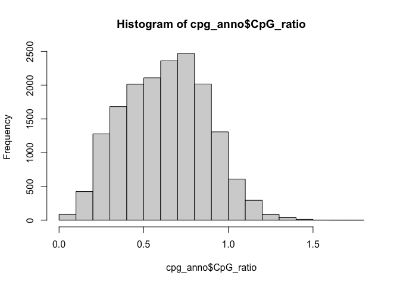
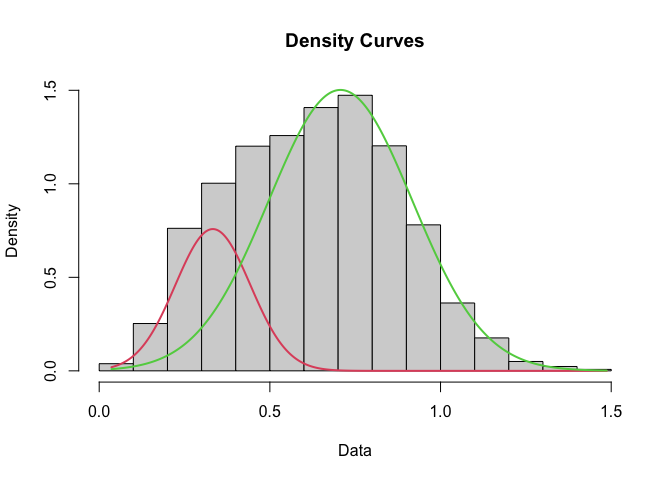
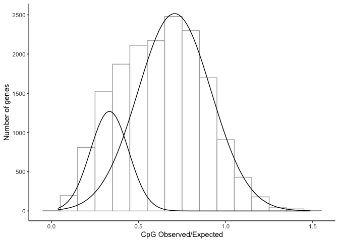

CpG OE Ratio
================
Author: Emma Strand; <emma_strand@uri.edu>

Input is from script to calculate CpG ratios:
<https://github.com/emmastrand/EmmaStrand_Notebook/blob/master/_posts/2022-11-19-CpG-OE-Analysis-for-DNA-Methylation.md>

This R script and model is based on Jay Dimond’s:
<https://github.com/jldimond/Coral-CpG/blob/master/analyses/scripts/CpG_Density.R>

## Load libraries

``` r
library(plyr)
library(dplyr)
```

    ## 
    ## Attaching package: 'dplyr'

    ## The following objects are masked from 'package:plyr':
    ## 
    ##     arrange, count, desc, failwith, id, mutate, rename, summarise,
    ##     summarize

    ## The following objects are masked from 'package:stats':
    ## 
    ##     filter, lag

    ## The following objects are masked from 'package:base':
    ## 
    ##     intersect, setdiff, setequal, union

``` r
library(ggplot2)
library(mixtools)
```

    ## mixtools package, version 1.2.0, Released 2020-02-05
    ## This package is based upon work supported by the National Science Foundation under Grant No. SES-0518772.

``` r
library(fitdistrplus)
```

    ## Loading required package: MASS

    ## 
    ## Attaching package: 'MASS'

    ## The following object is masked from 'package:dplyr':
    ## 
    ##     select

    ## Loading required package: survival

## Load data

``` r
cpg_anno <- read.delim("data/WGBS/Pacuta_cpg_anno.txt", header=FALSE) %>%
  rename(Gene = V1) %>% rename(CpG_ratio = V2)

set.seed(101)
```

## Choosing cut-offs

``` r
range(cpg_anno$CpG_ratio)
```

    ## [1] 0.00000 1.76946

``` r
hist(cpg_anno$CpG_ratio)
```

<!-- -->

``` r
cpg_anno <- cpg_anno %>% 
  filter(CpG_ratio >= 0.001) %>% # setting minimum
  filter(CpG_ratio <= 1.5) # setting maximum 

range(cpg_anno$CpG_ratio)
```

    ## [1] 0.0360505 1.4867100

## Fitting mixture model with mixtools normalmixEM

<https://dozenoaks.twelvetreeslab.co.uk/2019/06/mixture-models/>

`normalmixEM` functions is telling it to find two gaussians in the
observations

``` r
mixmodel <- normalmixEM(cpg_anno$CpG_ratio, k = 2)
```

    ## number of iterations= 460

``` r
plot(mixmodel, which = 2)
```

<!-- -->

### Plotting the above model

``` r
cpg_anno %>% 
  ggplot(., aes(x=CpG_ratio)) + theme_classic() + 
  geom_histogram(binwidth=0.1, fill = "white", color="darkgrey", alpha=0.9) + 
  ylab("Number of genes") + xlab("CpG Observed/Expected") +
  mapply(
    function(mean, sd, lambda, n, binwidth) {
      stat_function(
        fun = function(x) {
          (dnorm(x, mean = mean, sd = sd)) * n * binwidth * lambda
        }
      )
    },
    mean = mixmodel[["mu"]], #mean
    sd = mixmodel[["sigma"]], #standard deviation
    lambda = mixmodel[["lambda"]], #amplitude
    n = length(cpg_anno$CpG_ratio), #sample size
    binwidth = 0.1 #binwidth used for histogram; needs to match the above binwidth 
  )
```

<!-- -->

## Finds intersection point of two component model

``` r
intersect <- function(m1, s1, m2, s2, prop1, prop2){
  
  B <- (m1/s1^2 - m2/s2^2)
  A <- 0.5*(1/s2^2 - 1/s1^2)
  C <- 0.5*(m2^2/s2^2 - m1^2/s1^2) - log((s1/s2)*(prop2/prop1))
  
  (-B + c(1,-1)*sqrt(B^2 - 4*A*C))/(2*A)
}

mixmodel[["mu"]] #means
```

    ## [1] 0.3329731 0.7069911

``` r
mixmodel[["sigma"]] #standard deviations
```

    ## [1] 0.1097526 0.2102262

``` r
mixmodel[["lambda"]] #amplitudes
```

    ## [1] 0.2085349 0.7914651

``` r
intersect_pt <- intersect(mixmodel[["mu"]][1], mixmodel[["sigma"]][1], 
                          mixmodel[["mu"]][2], mixmodel[["sigma"]][2], 
                          mixmodel[["lambda"]][1], mixmodel[["lambda"]][2])
```

## Tests fit of single component model

``` r
fitdistr(cpg_anno$CpG_ratio, "normal")
```

    ##       mean           sd     
    ##   0.628995208   0.246128565 
    ##  (0.001901301) (0.001344423)

## Weakly and heavily methylated genes

``` r
cpg_anno <- cpg_anno %>%
  mutate(status = if_else(CpG_ratio >= intersect_pt[2], "weakly", "heavily"))

nrow(cpg_anno) # 16,758
```

    ## [1] 16758

``` r
nrow(cpg_anno[cpg_anno$status == "weakly",]) # 13,023
```

    ## [1] 13023

``` r
nrow(cpg_anno[cpg_anno$status == "heavily",])# 3,735
```

    ## [1] 3735
